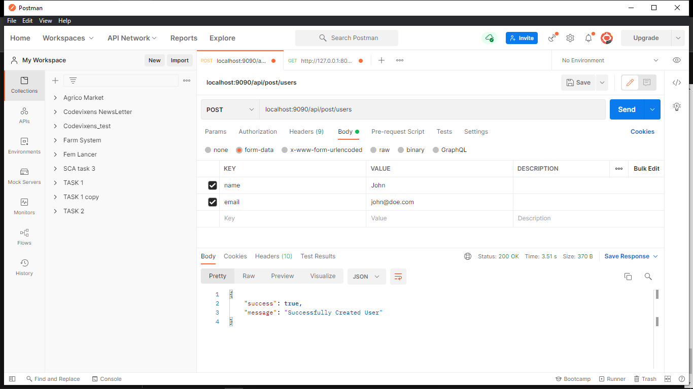
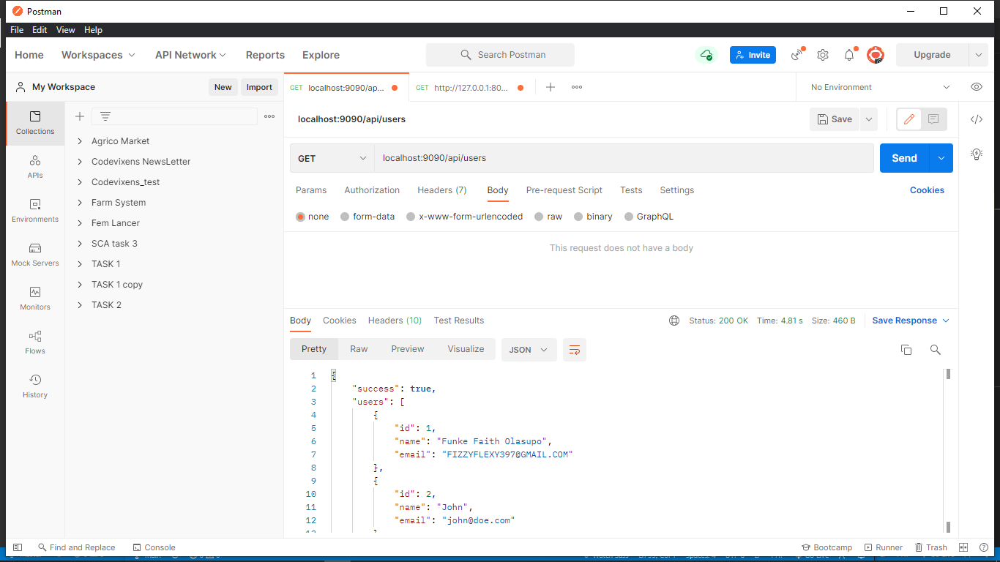
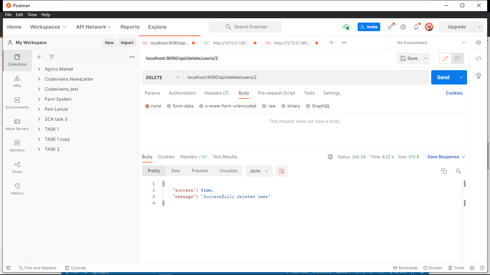

# Consuming External APIs in Laravel with Guzzle

## Preface

From our favourite bank applications to social media apps, the modern world of web development is being driven by APIs (application programming interfaces). They have become vital tools for all businesses in the technology industry because they allow one computer program to be used by another. For example, making outgoing HTTP requests to communicate with other web applications is simpler in Laravel 8. Laravel wraps the Guzzle HTTP client in an expressive, basic API, allowing you to swiftly send outgoing HTTP requests to communicate with other web apps. Guzzle's wrapper in Laravel focuses on the most popular use cases while providing a great development experience. The new methods will save time and reduce the number of lines of code in your application, making it more readable.

## Introduction

This article will educate readers on APIs, as well as guide them on how to consume external APIs in a [Laravel](https://laravel.com/docs/8.x/http-client#guzzle-options) application using [Guzzle](https://docs.guzzlephp.org/en/stable/).

A common use case is when two Laravel applications are developed, and one functions as the server while the other is the client. They will need to make requests to each other. Here are a few things we’ll cover in this article:

- What is an API?
- Difference between external and internal APIs.
- What is Guzzle?
- Laravel’s HTTP Client.
- Making requests.
- Inspecting the response format.

## Prerequisites

The following will help you keep up with this tutorial:

- [Composer](https://getcomposer.org/) installed globally
- [Laravel 8](https://laravel.com/docs/8.x/installation) already installed
- Beginner knowledge of Laravel
- [Postman](https://www.postman.com/api-documentation-tool/)

## What Is an API?

An API is a software-to-software interface that enables two applications to exchange data. APIs are propelling a new era of service-sharing innovation. They are used by nearly every major website you can think of, including Google, Facebook, and Amazon. All of these websites and tools use and provide ways for other websites and products to consume and extend each other's data and services. You've been in the presence of an API if you've ever signed into an app or service using your Facebook or Google credentials.

They serve as a bridge between developers and the different programs that people and organizations use on a regular basis, allowing them to create new programmatic interactions. Companies can open up their applications' data and functionality to external third-party developers, commercial partners, and internal departments through an application programming interface, or API. Through a documented interface, services and products can communicate with one another and benefit from each other's data and capability.

Here are some common examples of APIs:

- Pay with PayPal
- Twitter Bots
- Sign In with Google

## How Do APIs Work?

APIs operate as an intermediary layer between an application and a web server, facilitating data transfer across systems. To retrieve information, a client application makes an API call, often known as a request. This request, which contains a request verb, headers, and sometimes a request body, is sent from an application to the webserver via the API's uniform resource identifier (URI).
The API makes a call to the external program or web server after receiving a valid request. The server responds to the API with the requested data. The data are transferred to the requesting application via the API.

## Internal vs. External APIs

**Internal APIs** provide a safe environment for teams to share data and break down traditional data silos. An internal API is an interface that allows developers to gain access to a company's backend information and application functionality. The new apps built by these developers can subsequently be shared with the public, although the interface is hidden from anyone who isn't working directly with the API publisher.
Internal APIs can help cut down on the amount of time and resources required to develop apps and the resources. Developers can leverage a standardized pool of internal software assets instead of designing apps from scratch.

**External APIs** provide secure communication and content sharing outside of an organization, resulting in a more engaging customer experience. An external or open API is an API designed for access by a larger population, as well as by web developers. Thus, an external API can be easily used by developers inside the organization (that published the API) and any other developer from the outside who desires to register with the interface.

## Benefits of APIs

### Abstraction

An API makes programming easier by abstracting the implementation and just exposing the objects or actions that the developer needs.

### Security

They enable secure communication of abstracted data to be displayed or used as required.

### Automation

APIs allow computers to manage tasks rather than individuals. Agencies can use APIs to update workflows to make them more efficient.

### Personalization

An API can be used to establish an application layer for use in disseminating information and services to new audiences and can be customized to create unique user experiences.

## What Is a REST API?

**REST** ***is an acronym for*** **representational state transfer.** The first distinction to make is that API is the superset, whereas REST API is the subset. This implies that while all REST APIs are APIs, not all APIs are REST APIs. REST is a software architectural style developed to guide the design and development of the World Wide Web's architecture. REST API is an API that follows the design principles of the REST architectural style. REST APIs are sometimes referred to as RESTful APIs because of this. For developers, REST provides a considerable amount of flexibility and independence. REST APIs have become a popular approach for connecting components and applications in a microservices architecture because of their flexibility.

REST APIs use HTTP requests to perform common database activities, including creating, reading, updating, and deleting records (also known as CRUD). A REST API might, for example, use a GET request to retrieve a record, a POST request to create one, a PUT request to update one, and a DELETE request to delete one.

## What is Guzzle?

[**Guzzle**](https://docs.guzzlephp.org/en/stable/) is a **PHP HTTP** client that makes sending HTTP requests with data and headers easy. It also makes integrating with web services simple. It offers a simple yet powerful interface for sending POST requests, streaming massive uploads and downloads, using HTTP cookies, and uploading JSON data, among other things. One amazing feature is that it allows you to make synchronous and asynchronous requests from the same interface.

Previously, we relied on [cURL](https://curl.se/docs/) for similar tasks. However, as time passed, more advancements have been made. Guzzle is a result of one of these advancements.

## Laravel’s HTTP Client

Laravel wraps the Guzzle HTTP client in an expressive, basic API, allowing one application to swiftly make outgoing HTTP requests to communicate with other web apps efficiently. Requests can be sent, and responses can be retrieved using a HTTP Client. Guzzle is a powerful HTTP client, but when performing a simple HTTP GET or retrieving data from a JSON API, the 80% use-case seems difficult. Here are some popular features the [Laravel HTTP Client](https://laravel.com/docs/8.x/http-client) provides:

- JSON response data is easily accessible.
- There's no need for a boilerplate setup to make a simple request.
- Failed requests are retried.

You may need to use Guzzle directly for more complicated HTTP client tasks. However, [Laravel’s HTTP Client](https://laravel.com/docs/8.x/http-client) includes everything you'll need for most of your applications.

## Making HTTP Requests to an API Using Laravel’s HTTP Client

For us to explore various options and use cases for Laravel’s HTTP Client, we’ll build a Laravel application that shows how to make requests to an external API using [Laravel’s HTTP Client](https://laravel.com/docs/8.x/http-client).

> Note: The external API being used here is hosted on my local server.   You can use any API you desire; its important to ensure you get the correct URL to make request to the API.

The URL that we will be hitting on the user API for this article is the following:

```bash
http://127.0.0.1:8000
```

### Create a New Laravel Project

You can create a new Laravel project via the Composer command or the Laravel installer:

```bash
laravel new project_name   
    or
composer create-project laravel/laravel project_name
```

### Install the Package

You need make sure that the Guzzle package is installed as a dependency of your application. You can install it using Composer:

```bash
composer require guzzlehttp/guzzle
```

### Set Up the `URL` in `.env` and in the `config/app` Directory

Considering that you’ll be using this URL more than once, it’s a good idea to store it as one of your environment variables. This is beneficial because, if the URL needs to be changed later on, only the `.env` file will be modified rather than all the points at which the URL is called in the application. Store the URL as a variable in the `.env` file.

```php
GUZZLE_TEST_URL=http://127.0.0.1:8000
```

Add it to the `return[]` array in `config/app.php` directory.

```php
'guzzle_test_url' => env('GUZZLE_TEST_URL'),
```

Next, clear your configuration and application cache by running these commands:

```bash
php artisan config:cache
php artisan cache:clear
```

### Set up the Controller

You’ll be making  `GET`, `POST`, and `DELETE` requests to the API in the controller.

Create the controller with this Artisan command:

```bash
php artisan make:controller TestController
```

### Import the Http Facade

```php
use Illuminate\Support\Facades\Http;
```

> **Note: The base URL is being fetched from ** `**config/app.php**` **, and the specific endpoint for a request is appended to it.**

### Make a `POST` Request

```php
public function createUser(Request $request){
$theUrl     = config('app.guzzle_test_url').'/api/users/create';
  $response= Http::post($theUrl, [
      'name'=>$request->name,
      'email'=>$request->email
  ]);
  return $response;
}
```

### Make a `GET` Request

```php
public function getUsers(){
   $theUrl     = config('app.guzzle_test_url').'/api/users/';
   $users   = Http ::get($theUrl);
   return $users;
}
```

### Make a `DELETE` Request

```php
public function deleteUser($id){
$theUrl     = config('app.guzzle_test_url').'/api/users/delete/'.$id;
     $delete   = Http ::delete($theUrl);
    return $delete;
}
```

### Set Up the Route

Since this is an API, the routes are defined in the `routes/api.php` directory.

```php
Route::post('post/users', [TestController::class, 'createUser']);
Route::get('users/', [TestController::class, 'getUsers']);
Route::delete('delete/users/{id}', [TestController::class, 'deleteUser']);
```

### Serve the Project

Run this Artisan command to serve the project:

> **Note: I am using port 9000; you can use your desired port.**

```bash
php artisan serve --port 9090
```

## Testing

We’ll be using [Postman](https://www.postman.com/api-documentation-tool/) to test the API. These are the results for the requests, and they return successful for every request.





## Inspect the Response Format

Laravel’s HTTP Client provides a list of options containing various formats in which response can be returned. Further queries can be performed on the response, depending on the format it is returned in. It returns a string by default.

### String

```php
$response->body() 
```

### Object

```php
 $response->object() 
```

### JSON

```php
$response->json() 
```

Check out the [official Laravel documentation](https://laravel.com/docs/8.x/http-client) to learn more about [Laravel’s HTTP Client.](https://laravel.com/docs/8.x/http-client) It provides various options, such as adding [Authentication with Bearer Token](https://laravel.com/docs/8.x/http-client#authentication),[Headers](https://laravel.com/docs/8.x/http-client#headers), [Timeout](https://laravel.com/docs/8.x/http-client#timeout), and many other options, to make requests more flexible.

## Conclusion

In this tutorial, you’ve learned how to consume APIs in Laravel using Laravel’s HTTP Client. Consuming APIs in Laravel is a broad concept on its own, but this tutorial can serve as a great starter guide. More information can be found in the [official Laravel documentation](https://laravel.com/docs/8.x/http-client#introduction). The code for this project is open-source and available [on GitHub](https://github.com/Roxie-32/guzzle-http).

I am open to questions, contributions, and conversations on better ways to implement APIs, so please comment on the repository or DM me [@twitter](https://twitter.com/OlasupoFunke).

Thanks for reading🤝.
# Consuming External APIs in Laravel with Guzzle

## Preface

From our favourite bank applications to social media apps, the modern world of web development is being driven by APIs (application programming interfaces). They have become vital tools for all businesses in the technology industry because they allow one computer program to be used by another. For example, making outgoing HTTP requests to communicate with other web applications is simpler in Laravel 8. Laravel wraps the Guzzle HTTP client in an expressive, basic API, allowing you to swiftly send outgoing HTTP requests to communicate with other web apps. Guzzle's wrapper in Laravel focuses on the most popular use cases while providing a great development experience. The new methods will save time and reduce the number of lines of code in your application, making it more readable.

## Introduction

This article will educate readers on APIs, as well as guide them on how to consume external APIs in a [Laravel](https://laravel.com/docs/8.x/http-client#guzzle-options) application using [Guzzle](https://docs.guzzlephp.org/en/stable/).

A common use case is when two Laravel applications are developed, and one functions as the server while the other is the client. They will need to make requests to each other. Here are a few things we’ll cover in this article:

- What is an API?
- Difference between external and internal APIs.
- What is Guzzle?
- Laravel’s HTTP Client.
- Making requests.
- Inspecting the response format.

## Prerequisites

The following will help you keep up with this tutorial:

- [Composer](https://getcomposer.org/) installed globally
- [Laravel 8](https://laravel.com/docs/8.x/installation) already installed
- Beginner knowledge of Laravel
- [Postman](https://www.postman.com/api-documentation-tool/)

## What Is an API?

An API is a software-to-software interface that enables two applications to exchange data. APIs are propelling a new era of service-sharing innovation. They are used by nearly every major website you can think of, including Google, Facebook, and Amazon. All of these websites and tools use and provide ways for other websites and products to consume and extend each other's data and services. You've been in the presence of an API if you've ever signed into an app or service using your Facebook or Google credentials.

They serve as a bridge between developers and the different programs that people and organizations use on a regular basis, allowing them to create new programmatic interactions. Companies can open up their applications' data and functionality to external third-party developers, commercial partners, and internal departments through an application programming interface, or API. Through a documented interface, services and products can communicate with one another and benefit from each other's data and capability.

Here are some common examples of APIs:

- Pay with PayPal
- Twitter Bots
- Sign In with Google

## How Do APIs Work?

APIs operate as an intermediary layer between an application and a web server, facilitating data transfer across systems. To retrieve information, a client application makes an API call, often known as a request. This request, which contains a request verb, headers, and sometimes a request body, is sent from an application to the webserver via the API's uniform resource identifier (URI).
The API makes a call to the external program or web server after receiving a valid request. The server responds to the API with the requested data. The data are transferred to the requesting application via the API.

## Internal vs. External APIs

**Internal APIs** provide a safe environment for teams to share data and break down traditional data silos. An internal API is an interface that allows developers to gain access to a company's backend information and application functionality. The new apps built by these developers can subsequently be shared with the public, although the interface is hidden from anyone who isn't working directly with the API publisher.
Internal APIs can help cut down on the amount of time and resources required to develop apps and the resources. Developers can leverage a standardized pool of internal software assets instead of designing apps from scratch.

**External APIs** provide secure communication and content sharing outside of an organization, resulting in a more engaging customer experience. An external or open API is an API designed for access by a larger population, as well as by web developers. Thus, an external API can be easily used by developers inside the organization (that published the API) and any other developer from the outside who desires to register with the interface.

## Benefits of APIs

### Abstraction

An API makes programming easier by abstracting the implementation and just exposing the objects or actions that the developer needs.

### Security

They enable secure communication of abstracted data to be displayed or used as required.

### Automation

APIs allow computers to manage tasks rather than individuals. Agencies can use APIs to update workflows to make them more efficient.

### Personalization

An API can be used to establish an application layer for use in disseminating information and services to new audiences and can be customized to create unique user experiences.

## What Is a REST API?

**REST** ***is an acronym for*** **representational state transfer.** The first distinction to make is that API is the superset, whereas REST API is the subset. This implies that while all REST APIs are APIs, not all APIs are REST APIs. REST is a software architectural style developed to guide the design and development of the World Wide Web's architecture. REST API is an API that follows the design principles of the REST architectural style. REST APIs are sometimes referred to as RESTful APIs because of this. For developers, REST provides a considerable amount of flexibility and independence. REST APIs have become a popular approach for connecting components and applications in a microservices architecture because of their flexibility.

REST APIs use HTTP requests to perform common database activities, including creating, reading, updating, and deleting records (also known as CRUD). A REST API might, for example, use a GET request to retrieve a record, a POST request to create one, a PUT request to update one, and a DELETE request to delete one.

## What is Guzzle?

[**Guzzle**](https://docs.guzzlephp.org/en/stable/) is a **PHP HTTP** client that makes sending HTTP requests with data and headers easy. It also makes integrating with web services simple. It offers a simple yet powerful interface for sending POST requests, streaming massive uploads and downloads, using HTTP cookies, and uploading JSON data, among other things. One amazing feature is that it allows you to make synchronous and asynchronous requests from the same interface.

Previously, we relied on [cURL](https://curl.se/docs/) for similar tasks. However, as time passed, more advancements have been made. Guzzle is a result of one of these advancements.

## Laravel’s HTTP Client

Laravel wraps the Guzzle HTTP client in an expressive, basic API, allowing one application to swiftly make outgoing HTTP requests to communicate with other web apps efficiently. Requests can be sent, and responses can be retrieved using a HTTP Client. Guzzle is a powerful HTTP client, but when performing a simple HTTP GET or retrieving data from a JSON API, the 80% use-case seems difficult. Here are some popular features the [Laravel HTTP Client](https://laravel.com/docs/8.x/http-client) provides:

- JSON response data is easily accessible.
- There's no need for a boilerplate setup to make a simple request.
- Failed requests are retried.

You may need to use Guzzle directly for more complicated HTTP client tasks. However, [Laravel’s HTTP Client](https://laravel.com/docs/8.x/http-client) includes everything you'll need for most of your applications.

## Making HTTP Requests to an API Using Laravel’s HTTP Client

For us to explore various options and use cases for Laravel’s HTTP Client, we’ll build a Laravel application that shows how to make requests to an external API using [Laravel’s HTTP Client](https://laravel.com/docs/8.x/http-client).

> Note: The external API being used here is hosted on my local server.   You can use any API you desire; its important to ensure you get the correct URL to make request to the API.

The URL that we will be hitting on the user API for this article is the following:

```bash
http://127.0.0.1:8000
```

### Create a New Laravel Project

You can create a new Laravel project via the Composer command or the Laravel installer:

```bash
laravel new project_name   
    or
composer create-project laravel/laravel project_name
```

### Install the Package

You need make sure that the Guzzle package is installed as a dependency of your application. You can install it using Composer:

```bash
composer require guzzlehttp/guzzle
```

### Set Up the `URL` in `.env` and in the `config/app` Directory

Considering that you’ll be using this URL more than once, it’s a good idea to store it as one of your environment variables. This is beneficial because, if the URL needs to be changed later on, only the `.env` file will be modified rather than all the points at which the URL is called in the application. Store the URL as a variable in the `.env` file.

```php
GUZZLE_TEST_URL=http://127.0.0.1:8000
```

Add it to the `return[]` array in `config/app.php` directory.

```php
'guzzle_test_url' => env('GUZZLE_TEST_URL'),
```

Next, clear your configuration and application cache by running these commands:

```bash
php artisan config:cache
php artisan cache:clear
```

### Set up the Controller

You’ll be making  `GET`, `POST`, and `DELETE` requests to the API in the controller.

Create the controller with this Artisan command:

```bash
php artisan make:controller TestController
```

### Import the Http Facade

```php
use Illuminate\Support\Facades\Http;
```

> **Note: The base URL is being fetched from ** `**config/app.php**` **, and the specific endpoint for a request is appended to it.**

### Make a `POST` Request

```php
public function createUser(Request $request){
$theUrl     = config('app.guzzle_test_url').'/api/users/create';
  $response= Http::post($theUrl, [
      'name'=>$request->name,
      'email'=>$request->email
  ]);
  return $response;
}
```

### Make a `GET` Request

```php
public function getUsers(){
   $theUrl     = config('app.guzzle_test_url').'/api/users/';
   $users   = Http ::get($theUrl);
   return $users;
}
```

### Make a `DELETE` Request

```php
public function deleteUser($id){
$theUrl     = config('app.guzzle_test_url').'/api/users/delete/'.$id;
     $delete   = Http ::delete($theUrl);
    return $delete;
}
```

### Set Up the Route

Since this is an API, the routes are defined in the `routes/api.php` directory.

```php
Route::post('post/users', [TestController::class, 'createUser']);
Route::get('users/', [TestController::class, 'getUsers']);
Route::delete('delete/users/{id}', [TestController::class, 'deleteUser']);
```

### Serve the Project

Run this Artisan command to serve the project:

> **Note: I am using port 9000; you can use your desired port.**

```bash
php artisan serve --port 9090
```

## Testing

We’ll be using [Postman](https://www.postman.com/api-documentation-tool/) to test the API. These are the results for the requests, and they return successful for every request.


## Inspect the Response Format

Laravel’s HTTP Client provides a list of options containing various formats in which response can be returned. Further queries can be performed on the response, depending on the format it is returned in. It returns a string by default.

### String

```php
$response->body() 
```

### Object

```php
 $response->object() 
```

### JSON

```php
$response->json() 
```

Check out the [official Laravel documentation](https://laravel.com/docs/8.x/http-client) to learn more about [Laravel’s HTTP Client.](https://laravel.com/docs/8.x/http-client) It provides various options, such as adding [Authentication with Bearer Token](https://laravel.com/docs/8.x/http-client#authentication),[Headers](https://laravel.com/docs/8.x/http-client#headers), [Timeout](https://laravel.com/docs/8.x/http-client#timeout), and many other options, to make requests more flexible.

## Conclusion

In this tutorial, you’ve learned how to consume APIs in Laravel using Laravel’s HTTP Client. Consuming APIs in Laravel is a broad concept on its own, but this tutorial can serve as a great starter guide. More information can be found in the [official Laravel documentation](https://laravel.com/docs/8.x/http-client#introduction). The code for this project is open-source and available [on GitHub](https://github.com/Roxie-32/guzzle-http).

I am open to questions, contributions, and conversations on better ways to implement APIs, so please comment on the repository or DM me [@twitter](https://twitter.com/OlasupoFunke).

Thanks for reading🤝.
